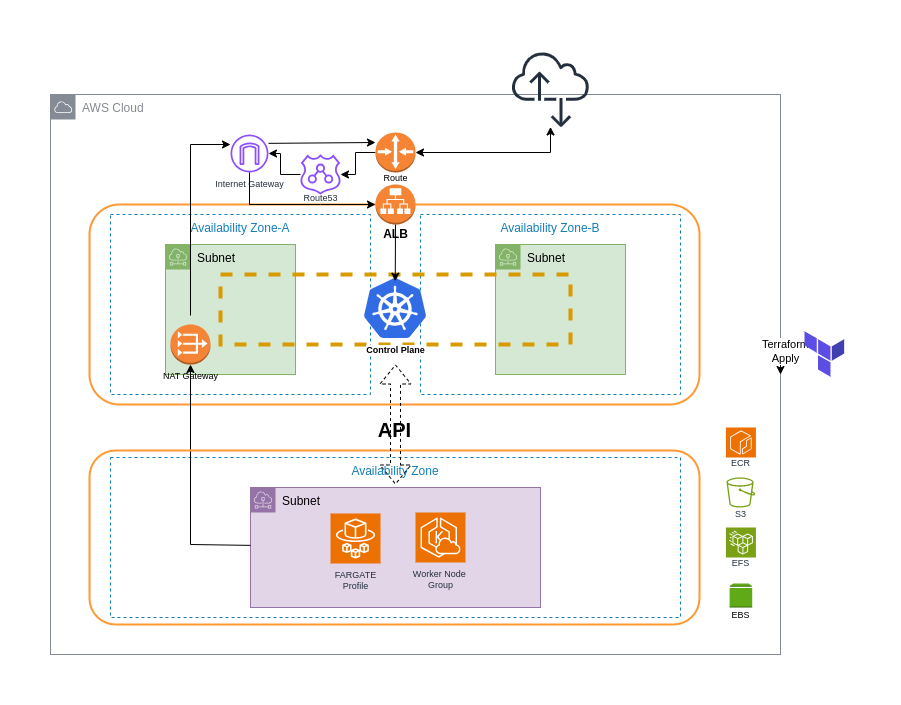

# Effortless EKS Cluster Setup: Terraform Module for Hybrid EC2 and Fargate Environments Supporting Essential Kubernetes Tools

# ARCHITECTURE



# TABLE OF CONTENTS

-[Artchitecture](#architecute)
-[Overview](#overview)
-[Discussion](#discussion)
  -[Providers](#providers)
  -[Cluster Resource](#clsuter-resource)
  -[Worker Node](#worker-node)
  -[Plugins & Storage Drivers](#plugins-and-storage-drivers)
  -[Dependencies](#dependencies)
  -[VPC](#vpc)
-[How To](#how-to)
  -[Example](#example)
-[Complete Template](#complete-template)
-[Outputs](#outputs)
  -[VPC](#vpc-1)
  -[EKS](#eks)
-[Notes](#notes)
-[Limitations](#limitations)
-[Useful Links](#useful-links)
-[Licence](#-license)

# OVERVIEW

This is a Terraform template that automates creating a fully integrated EKS cluster including setting up its core addons, and deploying essential HELM charts with the related IAM policies, RBAC permissions and AWS resources.

*This template is made of two custom Terraform modules:*

## **EKS** **Module**

   1. Supports Worker Node creation.
   2. Supports EKS Addons & Logging, with permissions setup and deployment. In additon to:
      1. EFS CSI Driver - with storageClass.
      2. S3 CSI Driver - with storageClass.
      3. EBS CSI Driver (ebs.csi.aws.com) - with storageClass.
      4. AWS ECR resource creation.
   3. Supports Fargate Profile Deployment
   4. Supports IPv4 & IPv6 with dual-stack integration - including the HELM charts.
   5. Creates custom IAM Admin & Generic groups with access policies to the EKS cluster, for quick user access.
   6. Supports HELM chart plugins with configured values;
      1. AWS Load Balancer Controller
      2. Nginx Controller - running behind AWS Load Balancer Controller
      3. Metrics Server
      4. Cluster Autoscaler
      5. Cert Manager
      6. ArgoCD
      7. External Secrets
      8. Secrets Store CSI Driver
      9. Monitoring: Loki, Prometheus
      10. UI: Kubernetes Dashboard, Rancher
      11. Netowrking Calico CNI (Not tested).

## **VPC Module**

 1.  Supports dynamic private subnets and public subnets creation.
 2.  Supports automatic NAT gateway creation and attachment and association - in case private subnet is launched.
 3.  Supports dynamic security group rules creation.
 4.  Supports generating EKS related tags of labeling and AWS Load balancer recognition, for both of public and private subnets.

# DISCUSSION

[Elastic Kubernetes Service](https://docs.aws.amazon.com/eks/latest/userguide/eks-deployment-options.html) - EKS - is an AWS related service that runs kubernetes clusters with a variety of deployment options for both of the controle-plane node and the worker nodes. This project focuses on deploying EKS on AWS cloud with managed worker node and Fargate based worker nodes.

The EKS deployment is created by a custom terraform module that is prepared to set the cluster including the control plane, the worker nodes, official AWS EKS addons, and HELM charts with the neccessary IAM permissions, Kubernetes service accounts and binding roles, as well as basic helm values configuaration to allow a smooth integration on the cluster.

The EKS cluster can be deployed using the module arguments in the [Template](#complete-template) section.

## Providers

This template uses three providers; *AWS*, *HELM*, and *Kubernetes*.
HELM and kubernetes providers use the module's outputs to get the cluster's API credentials to access the EKS cluster. As an alternative method, the *kubeconfig* file can be used after fetching its data using aws cli as stated in the [Notes](#notes) section. Then they can be refered using the `config_path` provider argument.

## Clsuter Resource

### Permissions

It uses API authentication mode, with bootstrap cluster creator admin permissions. By default, it uses the STANDARD upgrade policy, while it can be overriden by the arguments.

It uses AmazonEKSVPCResourceController & AmazonEKSClusterPolicy based policies for the IAM role.

### Addons

All the addons use the latest versions that is fetched by the terraform data resource. They are also bound to the kubernetes cluster with the required IAM roles using `aws_eks_pod_identity_association`.

## Worker Node

By default, the worker node uses on-demand capacity type instances. For autoscalability, a *cluster autoscaler* manefist must be installed, this can be done using the helm chart in the plugins block.

### Permissions

Four basic permissions are assigned to the worker node's IAM role:
1. AmazonSSMManagedInstanceCore
2. AmazonEKSWorkerNodePolicy
3. AmazonEKS_CNI_Policy
4. AmazonEC2ContainerRegistryReadOnly

### FARGATE PROFILE

By default, the fargate profile will assign itself to a namespace called `fargate-space` which should be created by the user. This namespace can be overriden by assigning one using the `fargate_profile` block's argument.

The fargate profile uses `AmazonEKSFargatePodExecutionRolePolicy` IAM policy.

## Plugins and Storage Drivers

### HELM CHARTS

Each Helm chart is set to use the latest version. Each HELM resource uses custom values that integrate with the EKS cluster's atmosphere. 

Such as setting up the region, using service endpoints instead of localhosts, setting the serviceAccounts that were bound to the IAM roles by the *pod identity association*, setting nginx and AWS load balancer to use the required annotations to allow alb resource creation, changing IP-family and so on.

The optional settings can be changed using the available arguments of the plugin. Values argument can be used to set other configuration as well.

### Storage Drivers

This Project supports EBS, EFS, and S3 Storage providers. Each of these providers are deployed with the aws resource, IAM policies, and storageClass manefist files.

## Dependencies

Some resources depend on other resources such as **IAM roles > Cluster > Worker Node > Addons > plugins**.
While some plugins depend on each other as well, so a dependenecy was created between the required resources to avoid misconfiguration or errors during depployment.

## VPC

The VPC will generate the subnets whether public or private or both, with the security group inbound ports, ssh connect, and network connection through NAT and Internet Gateway including route table of each attachment. 

It also defines the public and private subnets with EKS tags for the [aws load balancer discovery](https://kubernetes-sigs.github.io/aws-load-balancer-controller/v2.10/deploy/subnet_discovery/)

# HOW TO

The quickest way to deploy is to use the example below and modify it with extra or less arguments in the Complete Template section. Each of the EKS and VPC modules can be used individually. Together they can create enough automation to prepare the kubernetes cluster.

In the EKS module, the plugins block depend on the worker node, while the EKS module should depend on the VPC module if created together. On the other hand, the argument types are mentioned in the Complete Template section below.

## EXAMPLE

```
module "vpc" {
  source = "./modules/vpc"
  name   = var.metadata.name
  vpc_settings = {
    vpc_cidr_block             = "192.168.0.0/19"
    public_subnet_cidr_blocks  = ["192.168.0.0/21", "192.168.8.0/21"]
    private_subnet_cidr_blocks = ["192.168.16.0/21"]
    create_private_subnets_nat = true
    availability_zones         = ["${var.metadata.region}a", "${var.metadata.region}b"]
    security_group = {
      ip_protocol = "-1"
      ssh_port = {
        cidr_ipv4 = "0.0.0.0/0"
      }
    }
    include_eks_tags = {
      cluster_name = var.metadata.name
    }
  }
}

module "eks" {
  source = "./modules/eks"
  metadata = {
    name        = var.metadata.name
    environment = var.metadata.environment
    eks_version = "1.30"
    region      = var.metadata.region
  }

  cluster_settings = {
    cluster_subnet_ids                = module.vpc.public_subnet_cidr_blocks
    security_group_ids                = [module.vpc.cluster_security_group_id]
    enable_endpoint_public_access     = true
    enable_endpoint_private_access    = true
    create_eks_admin_access_iam_group = true
    ip_family                         = "ipv4"

    addons = {
      vpc_cni                         = true
      eks_pod_identity_agent          = true
      amazon_cloudwatch_observability = true
      aws_ebs_csi_driver              = {}
      aws_efs_csi_driver = {
        enable     = true
        subnet_ids = module.vpc.private_subnet_cidr_blocks
      }
      aws_mountpoint_s3_csi_driver = {
        enable = true
      }

    }
  }

  node_settings = {
    cluster_name          = module.eks.cluster_name
    workernode_subnet_ids = module.vpc.private_subnet_cidr_blocks
    remote_access = {
      enable       = true
      ssh_key_name = ""
    }
    labels = {
      "environment" = "${var.metadata.environment}",
    }
    capacity_config = {
      instance_types = ["t3a.xlarge"]
      disk_size      = 20 # Optional, default to 20GB
    }
    scaling_config = {
      desired         = 1 # Optional, default to 1
      max_size        = 2 # Optional, default to 1
      min_size        = 1 # Optional, default to 1
      max_unavailable = 1 # Optional, default to 1
    }
  }

  plugins = {
    create_ecr_registry = true
    cluster_autoscaler  = {}
    metrics_server      = {}
    cert_manager        = {}
    argo_cd             = {}
    nginx_controller    = {}
    aws_alb_controller = {
      vpc_id = module.vpc.vpc_id
    }
    rancher = {
      host                 = ""
    }
  }
  depends_on = [module.vpc]
}

```

# COMPLETE TEMPLATE 

```
module "vpc" {
  source = "./modules/vpc"
  name   = var.metadata.name
  vpc_settings = {
    vpc_cidr_block             = string
    public_subnet_cidr_blocks  = list(string) # Optional if private subnet cidr created
    private_subnet_cidr_blocks = list(string) # Optional if public subnet cidr created
    create_private_subnets_nat = bool # Optional, defaults to true
    availability_zones         = list(string)
    security_group = { # Optional
      ports       = list(number)
      ip_protocol = string # Defaults to "tcp", for all ports "-1"
      source = { # Only one source is allowed.
        cidr_ipv4   = string
        cidr_ipv6   = string
        security_group   = string
        prefix_list_id   = string
      }
      ssh_port = { # Optional, creates port 22 rule for the cidr specified.
        cidr_ipv4 = string # Defaults to "0.0.0.0/0"
      }
    }
    include_eks_tags = { # Optional, Required for EKS cluster.
      cluster_name    = string
      shared_or_owned = string # Defaults to "owned"
    }
  }
}

module "eks" {
  source = "./modules/eks"
  metadata = {
    name        = string
    environment = string
    eks_version = string
    region  = string
  }

  cluster_settings = {
    cluster_subnet_ids = list(string)  # Required, min are two, in different AZs
    allowed_cidrs_to_access_cluster_publicly = list(string) # Optional, set default to "0.0.0.0/0"
    set_custom_pod_cidr_block = string  # Optional
    support_type = string # Optional, defaults to "STANDARD"
    ip_family = string # Optional, defaults to "ipv4"
    security_group_ids = list(string) # Optional, EKS will generate one if not specified.
    enable_endpoint_public_access = bool # Optional, defaults to true
    enable_endpoint_private_access = bool  # Optional, defaults to false
    create_eks_admin_access_iam_group = bool  # Optional, defaults to false
    create_eks_custom_access_iam_group = bool  # Optional, defaults to false

    enable_logging = {
      api               = bool # Optional, default to false
      audit             = bool # Optional, default to false
      authenticator     = bool # Optional, default to false
      controllerManager = bool # Optional, default to false
      scheduler         = bool # Optional, default to false
    }

    addons = {
      vpc_cni                         = bool # Optional, default to false
      eks_pod_identity_agent          = bool # Optional, default to true
      snapshot_controller             = bool # Optional, default to false
      aws_guardduty_agent             = bool # Optional, default to false
      amazon_cloudwatch_observability = bool # Optional, default to false
      aws_ebs_csi_driver = {
        fstype = string # Defaults to "ext4"
        ebs_type = string # Defaults to "gp3"
        iopsPerGB =  number # Optional
        encrypted = bool # Defaults to true
      }
      aws_efs_csi_driver = {
        enable          = bool # Defaults to false
        encrypted       = bool # Defaults to true
        subnet_ids      = list(string) # Required if no resource specified.
        efs_resource_id = string # Optional, resource will be created if not specified.
      }
      aws_mountpoint_s3_csi_driver = {
        enable        = bool # Defaults to false
        s3_bucket_arn = string # Optional, resource will be created if not specified.
      }
    }
  }

  node_settings = {
    cluster_name          = string # optional
    node_group_name       = string # optional
    workernode_subnet_ids = list(string)
    taints                = list(map(string)) # Optional, e.g. [{key = "", value = "", effect = ""}, {}]
    labels                = map(string) # Optional, e.g. {"key1" = "value1","key2" = "value2"}
    capacity_config = {
      capacity_type  = string # Optional, default to "ON_DEMAND"
      instance_types = list(string)
      disk_size      = number # Optional, default to 20GB
    }
    scaling_config = {
      desired         = number # Optional, default to 1
      max_size        = number # Optional, default to 1
      min_size        = number # Optional, default to 1
      max_unavailable = number # Optional, default to 1
    }
    remote_access  = { # Optional
      enable       = bool, false # Optional, defaults to false
      ssh_key_name = string
      allowed_security_groups = list(string) # Optional, defaults to "0.0.0.0/0" acccessibility
    }
  }

  fargate_profile = {
    cluster_name  = string # optional
    subnet_ids = list(string)
    fargate_profile_name = string # optional
    namespace = string # optional, if not stated, custom namespace "fargate-space" is specified
  }

  plugins = { # Optional, used as `argument = {}`
    dont_wait           = bool # Optional, defaults to true
    create_ecr_registry = bool # Optional, defaults to false
    cluster_autoscaler = {
      values = list(string) # Optional, e.g [<<EOF...EOF]
    } 
    metrics_server = {
      values = list(string) # Optional, e.g [<<EOF...EOF]
    }
    aws_alb_controller = {
      vpc_id = string
      values = list(string) # Optional, e.g [<<EOF...EOF]
    }
    nginx_controller = {
      scheme_type       = optional(string, "internet-facing") # OR "internal"
      enable_cross_zone = bool # Optional, default to false
      values            = list(string) # Optional, e.g [<<EOF...EOF]
    }
    argo_cd = {
      values = list(string) # Optional, e.g [<<EOF...EOF]
    }
    external_secrets = {
      values = list(string) # Optional, e.g [<<EOF...EOF]
    }
    secrets_store_csi_driver = {
      values = list(string) # Optional, e.g [<<EOF...EOF]
    }
    loki = {
      values = list(string) # Optional, e.g [<<EOF...EOF]
    }
    prometheus = {
      values = list(string) # Optional, e.g [<<EOF...EOF]
    }
    cert_manager = {
      values = list(string) # Optional, e.g [<<EOF...EOF]
    }
    kubernetes_dashboard = {
      hosts          = list(string)
      use_internally = bool # Optiona, defaults to false
      values = list(string) # Optional, e.g [<<EOF...EOF]
    }
    rancher = {
      host                 = string
      use_internal_ingress = bool # Optiona, defaults to false
      values = list(string) # Optional, e.g [<<EOF...EOF]
    }
    calico_cni = {
      enable = bool # Defaults to false
      cidr   = string  # Should be within the VPC CIDR, and not overlap with subnet CIDRs.
      values = list(string) # Optional, e.g [<<EOF...EOF]
    }
  }
}
```

# OUTPUTS

## VPC

```
# SECURITY GROUPS:
cluster_security_group_id

# SUBNETS
public_subnet_cidr_blocks
private_subnet_cidr_blocks

# VPC ID
vpc_id
```

## EKS

```
# CLUSTER ENDPOINT
endpoint

# KUBECONFIG CERTIFICATE AUTHORITY
kubeconfig-certificate-authority-data

# CLUSTER ID
cluster_id

# CLUSTER NAME
cluster_name

#########################
# BASED ON DATA RESOURCES
#########################
## CLUSTER CERTIFICATE
aws_eks_cluster_certificate_data

## CLUSTER ENDPOINT
aws_eks_cluster_data

## CLUSTER NAME
aws_eks_cluster_name

## CLUSTER TOKEN
aws_eks_cluster_auth

## ECR REGISTRY URL
ecr_registry
```
# NOTES

1. To connect `kubectl` with the EKS cluster, update the kubeconfig configuration file using AWS CLI. Make sure it's configured to use the profile that has access role to EKS cluster:
```
aws eks --region <REGION> update-kubeconfig --name <PROJECT_NAME>
```
2. HELM provider uses two methods to connect to the cluster. The first one is by refering to the EKS module endpoint. The second is by refering to the `kubeconfig` file in the local machine.
   * By default, the first method is used to automate Terraform deployment. However, if any change occures to the EKS cluster, then HELM connection to the cluster will get interrupted. To fix this, use `terraform init` to reinitiate the terraform providers or switch to the second method after updating the `kubeconfig` file, then reinitiate Terraform.

# LIMITATIONS

1. The first `terraform apply` will not deplpoy the HELM related resources - Plugins. It requries to do `Terraform refresh` or `Terraform init` then apply again.
2. If nginx controller or application load balancer controller were used, security group resources will be generated with ***k8-**** names. These will disturb the `Terraform destroy` process while deleting the VPC resource until they are deleted manually.

# USEFUL LINKS

1. [Maximum pods per ENI per EC2](https://github.com/aws/amazon-vpc-cni-k8s/blob/master/misc/eni-max-pods.txt)
2. [NGINX Controller](https://kubernetes.github.io/ingress-nginx/)
3. [AWS Load Balancer Controller Annotations](https://kubernetes-sigs.github.io/aws-load-balancer-controller/v2.10/guide/ingress/annotations/)
4. [IPv6 dual stack support](https://aws.amazon.com/about-aws/whats-new/2024/10/amazon-eks-endpoints-connectivity-ipv6/)

# 📝 LICENCE

This project is licensed under the MIT License. See the [LICENSE](LICENSE) file for details.

Copyright © 2024 [Obreo](https://github.com/obreo).